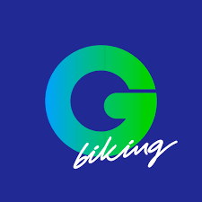
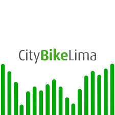

# Capítulo II: Requirements Elicitation & Analysis

## 2.1. Competidores

### 2.1.1 Análisis Competitivo
<table>
  <tr>
    <th colspan="22">Competitive Analysis Landscape</th>
  </tr>
  <tr>
    <td colspan="1">¿Por qué llevar a cabo el análisis?</td>
    <td colspan="17">Este análisis nos ayuda a entender las particularidades de cada sitio web o aplicación, identificar la competencia en el mercado y planificar cómo abordar las oportunidades. También nos permite trabajar en la mejora continua de nuestras áreas de desarrollo.</td>
  </tr>
  <tr>
    <td colspan="2">(En la cabecera colocar por cada competidor nombre y logo)</td>
    <td>Gogo Biking </td>
    <td>City Bike Lima </td>
    <td> -  </td>
    <td> -  </td>
</tr>
  <tr>
    <td rowspan="2">Perfil</td>
    <td>Overview</td>
    <td>GogoBiking es una empresa de alquiler de bicicletas y tours guiados en bicicleta ubicada en Lima, con un enfoque principal en las zonas turísticas de Miraflores y Barranco. Ofrecen una variedad de bicicletas para alquilar, incluyendo bicicletas de ciudad, bicicletas de montaña y bicicletas eléctricas, así como tours guiados en bicicleta por la ciudad y alrededores.</td>
    <td>CityBikeLima es un sistema de bicicletas compartidas que opera en Lima, con estaciones de autoservicio ubicadas en diferentes puntos de la ciudad. Los usuarios pueden alquilar bicicletas por períodos cortos o largos, utilizando una aplicación móvil o una tarjeta de membresía.</td>
    <td>-</td>
    <td>-</td>
  </tr>
  <tr>
  <td>Ventaja Competitiva</td>
  <td>Su principal ventaja competitiva radica en su enfoque en el turismo y la experiencia, ofreciendo tours guiados de alta calidad con guías expertos y conocedores de la ciudad. Además, cuentan con bicicletas en excelente estado y ofrecen servicios adicionales como alquiler de cascos, candados y mapas.</td>
    <td>Su principal ventaja es la conveniencia y accesibilidad que ofrece su sistema de autoservicio, permitiendo a los usuarios alquilar y devolver bicicletas en diferentes puntos de la ciudad de manera rápida y sencilla.</td>
    <td>-</td>
    <td>-</td>
    </tr>
<tr>
    <td rowspan="2">Perfil de Marketing</td>
    <td>Mercado Objetivo</td>
    <td>Su mercado objetivo principal son los turistas que visitan Lima y buscan explorar la ciudad de una manera activa y divertida. También atienden a locales que desean disfrutar de un paseo en bicicleta o participar en un tour guiado.</td>
    <td>Su mercado objetivo son los residentes de Lima que buscan una opción de transporte sostenible y conveniente para desplazamientos cortos dentro de la ciudad. También atienden a turistas que desean explorar la ciudad en bicicleta.</td>
    <td>-</td>
    <td>-</td>
  </tr>
  <tr>
  <td>Estrategias de Marketing</td>
  <td>GogoBiking utiliza una combinación de estrategias de marketing online y offline. Tienen una fuerte presencia en línea a través de su sitio web y redes sociales, donde promocionan sus servicios y tours. También trabajan con agencias de viajes y hoteles para llegar a un público más amplio.</td>
    <td>CityBikeLima se enfoca en el marketing digital a través de su sitio web, redes sociales y aplicación móvil. También realizan campañas de publicidad en medios de transporte público y espacios públicos.</td>
    <td>-</td>
    <td>-</td>
    </tr>
<tr>
    <td rowspan="3">Perfil de Producto</td>
    <td>Productos y Servicios</td>
    <td>- Alquiler de bicicletas por hora o día. 
    - Tours guiados en bicicleta por Lima y alrededores. 
    - Alquiler de equipos de seguridad (cascos, candados). 
    - Mapas y guías de la ciudad.</td>
    <td>- Alquiler de bicicletas por períodos cortos (30 minutos, 1 hora) o largos (día, semana, mes, año).  
- Membresías mensuales y anuales.  
- Aplicación móvil para localizar estaciones y alquilar bicicletas.
</td>
    <td>-</td>
    <td>-</td>
  </tr>
  <tr>
  <td>Precios y Costos</td>
  <td>- Alquiler de bicicletas: desde S/ 15 por hora hasta S/ 40 por día. 
- Tours guiados: desde S/ 60 por persona. 
- Equipos de seguridad: S/ 5 por artículo.</td>
    <td>-Alquiler por viaje corto: desde S/ 5 por 30 minutos. 
-Membresías: desde S/ 15 por mes hasta S/ 120 por año.</td>
    <td>-  </td>
    <td>- </td>
    </tr>
<td>Canales de distribución (Web y/o Móvil)</td>
  <td>Sitio web: https://www.gogobiking.pe/</td>
    <td>Sitio web: https://www.citybikelima.com/</td>
    <td> - </td>
    <td> - </td>
    </tr>
<tr>
    <td rowspan="4">Análisis SWOT</td>
    <td>Fortalezas</td>
    <td>- Buena reputación, tours de calidad, bicicletas en buen estado, ubicación conveniente.</td>
    <td>- Conveniencia, accesibilidad, sistema de autoservicio.</td>
    <td>- </td>
    <td>- </td>
  </tr>
  <tr>
  <td>Debilidades</td>
  <td>- Enfoque limitado en el mercado local, precios pueden ser elevados para algunos segmentos.</td>
    <td>- Disponibilidad limitada de bicicletas en horas pico, sistema de autoservicio puede ser confuso para algunos usuarios.</td>
    <td>- </td>
    <td>- </td>
    </tr>
<td>Oportunidades</td>
  <td>- Expandir su oferta de tours, desarrollar alianzas con más hoteles y agencias, ofrecer alquileres a largo plazo.</td>
    <td>- Expandir la red de estaciones, mejorar la aplicación móvil, ofrecer servicios adicionales como tours guiados o alquiler de bicicletas eléctricas.</td>
    <td>- </td>
    <td>- </td>
    </tr>
<td>Amenazas</td>
  <td>- Competencia de otras empresas de alquiler de bicicletas y tours, cambios en la demanda turística.</td>
    <td>- Competencia de otras empresas de alquiler de bicicletas y servicios de transporte compartido, vandalismo o robo de bicicletas.</td>
    <td>- </td>
    <td>- </tr>
</table>

### 2.1.2. Estrategias y tácticas frente a competidores.
Para posicionar BiciBreeze frente a competidores, se pueden implementar estrategias como alianzas con universidades para ofrecer descuentos exclusivos a estudiantes, programas de referidos para incentivar la recomendación entre amigos, y campañas de marketing digital enfocadas en resaltar la conveniencia y accesibilidad sobre el modelo de suscripción mensual. Además, se pueden organizar eventos y actividades en campus universitarios para generar comunidad y fidelizar a nuestros clientes. También, podemos considerar ofrecer servicios adicionales como talleres de mantenimiento de bicicletas o rutas guiadas para estudiantes, diferenciándonos aún más de la competencia.

## 2.2. Entrevistas
Las entrevistas buscan entender mejor a los usuarios y cómo usan la tecnología. Queremos saber qué piensan sobre los servicios en línea, los problemas que han tenido y qué esperan sobre nuestro proyecto.

### 2.2.1 Diseño de entrevistas 

**Preguntas para ambos segmentos**

- Presentación:
    - ¿Cual es su nombre?
    - ¿Que edad tiene?
    - ¿En qué Distrito vive?
    - ¿Estado Civil?
    - ¿Cual es su ocupación? ¿Estudia y/o trabaja?
    - Vamos relacionandonos un poco mas al tema tecnologico ¿Cuál es la herramienta tecnologica que mas usa? Entre PC y/o Celular, especificar si es Windows, Mac, Android o Iphone.
    - ¿Cuales son los navegadores de internet que mas usa a dia de hoy? (Edge, Chrome, Firefox, Opera o Safari)
    - ¿Qué canal de comunicación prefiere usar: Reuniones presenciales, llamadas telefónicas o mensajes de texto (WhatsApp, SMS, Redes Sociales)?
    -¿Qué marcas y/o influencias han tenido mayor impacto en usted?

**Preguntas para Estudiantes Universitarios**
- ¿Cuáles son los principales desafíos que enfrentas al desplazarte a la universidad? (tráfico, costo, tiempo, etc.)
- ¿Qué tan frecuentemente utilizas medios de transporte alternativos como bicicletas o scooters?
- ¿Estarías dispuesto a considerar un servicio de suscripción de bicicletas para tus desplazamientos diarios a la universidad? ¿Por qué o por qué no?
- ¿Qué características consideras más importantes en un servicio de suscripción de bicicletas? (precio, ubicación de estaciones, tipo de bicicletas, etc.)
- ¿Qué precio mensual estarías dispuesto a pagar por un servicio de suscripción de bicicletas que te permita desplazarte a la universidad y a otros lugares de interés?
- ¿Qué tipo de promociones o beneficios te gustaría recibir como estudiante universitario suscrito a BiciBreeze?

**Preguntas para Publico General**
- ¿Con qué frecuencia utilizas la bicicleta como medio de transporte en tu vida diaria?
- ¿Qué factores influyen en tu decisión de utilizar la bicicleta en lugar de otros medios de transporte?
- ¿Qué barreras o desafíos encuentras al utilizar la bicicleta en la ciudad?
- ¿Qué te atraería de un servicio de alquiler de bicicletas por horas o días?
- ¿Qué características o servicios adicionales valorarías en un servicio de alquiler de bicicletas? (seguros, asistencia en carretera, rutas guiadas, etc.)
- ¿Qué precio por hora o por día consideras razonable para alquilar una bicicleta en buen estado?

### 2.2.2. Registro de entrevistas 
En el proceso de investigación para nuestro proyecto, se llevaron a cabo entrevistas del público objetivo. Cada entrevista se documentó en video y se registraron los siguientes detalles:

Link de la entrevista:

#### Entrevista 1:

**Nombre y Apellido:**

**Edad:** 

**Distrito:** 

**Screenshot de la Entrevista:**

**Timelapse:** [Inicio: , Fin: ]

**Resumen de la Entrevista:**

#### Entrevista 2:

**Nombre y Apellido:**

**Edad:** 

**Distrito:** 

**Screenshot de la Entrevista:**

**Timelapse:** [Inicio: , Fin: ]

**Resumen de la Entrevista:**

#### Entrevista 3:

**Nombre y Apellido:**

**Edad:** 

**Distrito:** 

**Screenshot de la Entrevista:**

**Timelapse:** [Inicio: , Fin: ]

**Resumen de la Entrevista:**

### 2.2.3. Análisis de entrevistas

## 2.3. Needfinding
Posteriormente a las entrevistas, pudimos obtener la información sobre sus deseos, frustraciones, situación y múltiples datos que nos van a servir para satisfacer sus necesidades, mejorando la experiencia a nuestros usuarios. 
Esta información también nos ayudará a realizar los esquemas para las secciones de User Personas, User Task Matrix, User Journey Maps y el Empathy Mapping.

### 2.3.1. User Persona
Para desarrollar BiciBreeze, hemos entrevistado a estudiantes y usuarios de bicicletas. Estos datos nos permiten crear "User Personas" detalladas, que guiarán el diseño y desarrollo de nuestra plataforma para satisfacer las necesidades específicas de nuestros usuarios, ofreciendo una solución de movilidad eficiente y sostenible.

**_Segmento 1: Estudiantes Universitarios_**

**_Segmento 2: Publico General_**

### 2.3.2. User Task Matrix

Elaboramos los User Task Matrix  del Usuario con el propósito de determinar la frecuencia con la que los usuarios llevan a cabo diversas actividades, lo que nos permite visualizar la importancia de ciertas tareas.

**_Segmento 1: Estudiantes Universitarios_**

| Tareas                                                        | Universitario/a Importancia   | Universitario/a  Frecuencia               |
|---------------------------------------------------------------|--------------------------|--------------------------
| Movilizarse a la universidad y otros lugares de interés	                        |Alta                     | Siempre
| Buscar rutas eficientes y seguras en bicicleta	 |Alta                 | Siempre                  
| Comparar precios y opciones de transporte |Media         | A veces           
| Asistir a conferencias y eventos académicos                   |Media                   | A veces                  
| Acceder a información sobre promociones y descuentos |Media            | A veces                  
| Gestionar su tiempo y organizar su agenda        |Media                     | Diaria/Semanal                  
| Lidiar con el tráfico y la congestión	     |Alta                    | Diaria                 
| Preocuparse por la seguridad al viajar de noche                    |Media                     | Ocasionalmente    

**_Segmento 2: Publico General_**

| Tareas                                                        | Universitario/a Importancia   | Universitario/a  Frecuencia               |
|---------------------------------------------------------------|--------------------------|--------------------------
| Desplazarse al trabajo		                        |Alta                     | Diaria
| Ir a citas médicas, reuniones o eventos sociales	 |Media                 | Semanal/Mensual                  
| Comparar precios y opciones de transporte |Media         | Diaria/Semanal
| Evitar el tráfico y la congestión en horas pico                  |Alta                 | Diaria               
| Reducir gastos en transporte	 |Alta            | Semanal                  
| Gestionar su tiempo y organizar su agenda        |Media                     | Diaria/Semanal                              
| Preocuparse por la seguridad al viajar de noche                    |Media                     | Ocasionalmente    

**Analisis y Explicación:**

-Los estudiantes universitarios buscan transporte diario eficiente y económico, con seguridad y opciones flexibles.

-El público general busca alternativas al tráfico y al transporte público, con opciones recreativas y familiares.

-BiciBreeze puede ofrecer soluciones a ambos segmentos, destacando la conveniencia, el ahorro y la sostenibilidad.

### 2.3.3. User Journey Mapping

Creamos los User Journey Maps con el objetivo de comprender la experiencia de nuestro cliente al utilizar nuestra aplicación. Por ende, cada paso que el cliente realiza se detalla minuciosamente, incluyendo el proceso, los obstáculos encontrados y los pensamientos o emociones que surgen a raíz de ello.

**_Segmento 1: Estudiantes Universitarios_**

**_Segmento 2: Publico General_**

### 2.3.4. Empathy Mapping
Para el desarrollo de los Empathy Map hemos utilizado la información recopilada en base a nuestros dos User Personas que representan nuestro segmento.

**_Segmento 1: Estudiantes Universitarios_**

**_Segmento 2: Publico General_**

### 2.3.5. As-is Scenario Mapping
Realizamos una lluvia de ideas e identificamos las fases de acorde a lo propuesto en los User Persona. De tal modo, hemos conseguido realizar los As-Is mapping para los segmentos dados.

**_Segmento 1: Estudiantes Universitarios_**

**_Segmento 2: Publico General_**

### 2.3.6. Ubiquitous Language