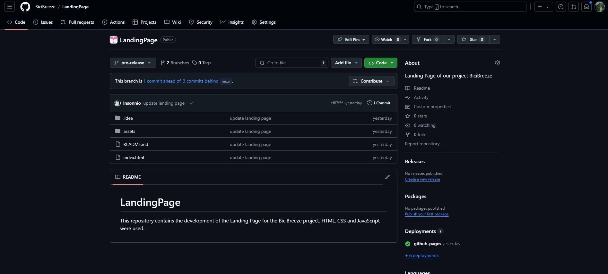

# Capítulo V Product Implementation, Validation & Deployment

### 5.1. Software Configuration Management

### 5.1.1. Software Development Environment Configuration

<strong>Requirements Management</strong> 

- Trello: Esta herramienta es utilizada para gestionar el flujo de trabajo de proyectos, especialmente aquellos basados en la metodología "Agile". La utilizaremos para visualizar y actualizar el estado de las tareas 
e historias de usuario queforman parte del sprint en desarrollo. Ruta de referencia:  https://trello.com/es

<strong>Product UX/UI Design</strong>
<ol>
  <li>Figma; Esta plataforma sirve para la creación de prototipos y la edición gráfica, utilizada principalmente en el diseñodigital. En este proyecto, se empleará para el prototipado de la aplicación, tanto en sus versiones 
para escritorio como para navegadores web móviles. Ruta de referencia: https://www.figma.com/login2 </li>
  <li>Lucidchart: Plataforma para diagramar flujos. Será utilizada para el diiseño de wireflows, user-flows y los diagramasde clases de nuestro proyecto. Ruta de referencia: https://www.lucidchart.com</li>
</ol>

<strong>Software Testing</strong>

- Gherkin: Sistema de etiquetado especial empleado para describir los criterios de aceptación de cada historia de usuario. Ruta de referencia: https://cucumber.io/docs/gherkin/

<strong>Software Development</strong>
<ol>
  <li>WebStorm es el entorno de desarrollo integrado (IDE) seleccionado para la creación y compilación del código debido al dominio que los miembros del equipo tienen sobre esta herramienta. Su uso aporta valor al 
proyecto, ya que permite agregar extensiones útiles, ofrece soporte para la edición de texto en múltiples lenguajes de programación, y está disponible en varios sistemas operativos, entre otras ventajas. Para más 
detalles, consulta la referencia: https://www.jetbrains.com/webstorm/.</li>
  <li>HTML5: HyperText Markup Language, o por sus siglas HTML, es un lenguaje de etiquetado para páginas web. Será empleado en eldesarrollo del proyecto para la presentación del contenido en la aplicación. Ruta de referencia https://www.w3schools.com/html/html5_syntax.asp</li>
  <li>CSS, o Cascading Style Sheets, es un lenguaje utilizado para gestionar el diseño y la presentación de las páginas web, complementando el uso de HTML. Para más información, consulta la referencia: https://google.github.io/styleguide/htmlcssguide.html.</li>
  <li>JavaScript es un lenguaje de programación interpretado y orientado a objetos. Se empleará para desarrollar la interfaz de usuario dentro de la aplicación. Puedes consultar más detalles en la referencia: https://developer.mozilla.org/es/docs/Web/JavaScript.</li>
  <li>C# es un lenguaje de programación orientado a objetos y desarrollado por Microsoft. Se utilizará en el proyecto para la creación de la lógica del servidor y el desarrollo de componentes backend. Este lenguaje es conocido por su robustez y capacidad para manejar 
aplicaciones de gran escala, siendo una elección ideal para desarrollar soluciones empresariales. Para más información, visita la referencia: https://learn.microsoft.com/es-es/dotnet/csharp/.</li>
  <li>Vue: Vue.js es un framework progresivo de JavaScript utilizado para construir interfaces de usuario interactivas y de una sola página (Single Page Applications o SPAs). Se centra en la capa de vista de una 
aplicación web, lo que significa que se utiliza principalmente para manejar la interfaz de usuario y las interacciones del usuario. Se basa en el patrón de diseño Modelo-Vista-Controlador (MVC) y proporciona un enfoque
reactivo para actualizar la interfaz de usuario en función de los cambios en los datos. Ruta de referencia: https://primevue.org/ </li>
</ol>

<strong>Software Deployment</strong>

- Git: Herramienta de control de versiones que permite registrar y gestionar las diferentes versiones del programa. Se utilizará para mantener un historial de cambios y simplificar la corrección de errores. 
Los miembros del equipo accederán a través de la línea de comandos en sus sistemas locales. Ruta de referencia:https://git-scm.com/ 

<strong>Software Documentation and Project Management</strong>

- GitHub: Plataforma basada en la nube que alojará los repositorios de código del proyecto. Facilitará la colaboración en tiempo real y la revisión de contribuciones de cada miembro del equipo. Los miembros 
del equipo accederán a través de sus navegadores web. Ruta de referencia: https://github.com/

### 5.1.2. Source Code Management

Nuestro proyecto seguirá los lineamientos del modelo GitFlow para controlar las versiones, donde utilizaremos GitHub como plataforma y sistema para el control de dichas versiones. Links del repositorio de GitHub:

- Link de la organización: https://github.com/BiciBreeze
- Link del informe del proyecto: https://github.com/BiciBreeze/Informe-TF

Estructura de las ramas:

- Main Branch: Rama principal de la aplicación. Se encuentran las versiones más actualizadas y estables de desarrollo, por medio de un proceso de admisión se agregan cambios de otras ramas derivadas.
- Develop Branch: Esta rama es donde se reunen de las demás ramas los avances del proyecto y desarollo. Se evalúan todos los cambios para ser registradas posteriormente en nuestra rama main.
- Chapter-01 Branch: En esta rama se actualizará toda la información y documentación del capítulo 1 del producto presentado.
- Chapter-02 Branch: En esta rama se actualizará toda la información y documentación del capítulo 2 del producto presentado.
- Chapter-03 Branch: En esta rama se actualizará toda la información y documentación del capítulo 3 del producto presentado.
- Chapter-04 Branch: En esta rama se actualizará toda la información y documentación del capítulo 4 del producto presentado.
- Chapter-05 Branch: En esta rama se actualizará toda la información y documentación del capítulo 5 del producto presentado.

### 5.1.3 Source Code Style Guide & Conventions

**HTML: Mejores prácticas seguidas**

- Utilizamos elementos HTML con un significado claro y preciso para el contenido marcado, como `header`, `nav`, `main`, `article`, `section`, `aside`, `footer`, entre otros, al estructurar la landing page. Esto evita redundancias y el uso incorrecto de elementos.
- Aunque HTML5 permite algunas etiquetas auto-cerradas (como `img` e `input`), seguimos la práctica de cerrar todas las etiquetas correctamente para prevenir problemas de renderizado. Por ejemplo: `
 Hola! Somos BiciBreeze!.
`
- Para mejorar la accesibilidad, siempre incluimos el atributo `alt` en las etiquetas `img` para describir brevemente el contenido de la imagen. Por ejemplo: ``
- Aunque HTML permite el uso de mayúsculas y minúsculas en nombres de elementos y atributos, utilizamos solo minúsculas para mantener el orden y mejorar la legibilidad del código.
- No omitimos etiquetas principales e importantes como `<html>`, `<body>`, `<header>`, entre otras.
- Escribimos los comentarios cortos en una sola línea.

**CSS: Buenas prácticas**

- Los nombres de clases son claros, precisos y autodescriptivos.
- Separamos los nombres de clases e IDs con guiones, por ejemplo: `#userWorker-id` o `button-shape{}`.
- Utilizamos comentarios claros para explicar el código.
- Aplicamos sangría a todo el contenido dentro de un bloque.
- Separar declaraciones y selectores en nuevas líneas para mantener una buena legibilidad y orden.

**JavaScript: Principales buenas prácticas**

- Empleamos la nomenclatura camelCase para nombrar variables y funciones, por ejemplo, `miVariable` o `miFuncion`.
- Usamos PascalCase para nombrar clases y constructores, por ejemplo, `MiClase`.
- Evitamos nombres de variables genéricos o ambiguos.
- Incluimos comentarios generales para explicar el propósito y la funcionalidad del código.
- Usamos punto y coma al final de cada declaración.
- Mantenemos consistencia en el uso de comillas simples (`''`) o dobles (`""`) para cadenas de texto.
- Aplicamos operadores ternarios de manera cuidadosa para asegurar la legibilidad, por ejemplo, `(condición ? resultadoTrue : resultadoFalse)`.
- Evitamos y eliminamos el uso de funciones obsoletas.
- Utilizamos `try-catch` para manejar y gestionar errores.
- Organizamos el código en bloques lógicos separados por líneas en blanco para mejorar la legibilidad.

**Gherkin:**

- Gherkin es un lenguaje de dominio especializado usado en el desarrollo guiado por comportamiento (BDD), diseñado para mejorar la comunicación entre equipos de negocios y técnicos al abordar problemas específicos. Utiliza saltos de línea y palabras clave como "Given", "When", "Then" y "And" para mejorar la legibilidad y organización de los escenarios en BDD, facilitando una estructura clara y efectiva de diferentes tipos de casos.

### 5.1.4 Software Deployment Configuration

#### Landing Page Deployment

Para desplegar la landing page de BiciBreeze resultó necesario cumplir una serie de requisitos, entre ellos, es necesario contar con una cuenta personal, una organización y un repositorio al cual cargar los documentos (se utilizará la plataforma Github Pages y Github Actions, para la implementación y despegue). Cumplido lo anterior, será posible comenzar el despliegue de la landing page. Estos son los pasos a seguir:

<ol>
  <li>Crear una carpeta Docs para alojar el landing page y especificar en Github Pages como fuente de la página.
  </li>
  <li>Asegurarse de que los archivos sigan los terminales correctos "index.html", para la landing page; "style.css" para los estilos y una carpeta "img" que contendrá las imágenes.
  </li>
  <li>Cargar los archivos mediante un push a la rama main del repositorio.</li>
  <li>Verificar que se haya desplegado correctamente.</li>

De tal modo, nuestra Landing Page estará inicializada utilizando Github Pages y podrá ser visible para cualquier usuario que tenga el enlace. Enlace del Landing Page: https://bicibreeze.github.io/LandingPage/ 

## 5.2 Landing Page, Services & Applications Implementation

### 5.2.1 Sprint 1

#### 5.2.1.1 Sprint Planning 1
Para este primer sprint nos enfocaremos en los tasks para la
elaboración de la Landing Page. Nos dividiremos entre nosotros cada
una de las tareas identificadas para el sprint.
<table>
<tr>
    <th colspan="5">Sprint #</th>
    <th colspan="9">Sprint 1</th>
  </tr>
      <tr>
    <td colspan="13">Sprint Planning Background</td>
  </tr>
  <tr>
    <td colspan="5">Date</td>
    <td colspan="8">2024-04-12</td>
</tr>
  <tr>
    <td colspan="5">Time</td>
    <td colspan="8">11:30 PM</td>
  </tr>
  <tr>
    <td colspan="5">Location</td>
    <td colspan="8">Via Discord y Google Meet</td>
<tr>
    <td colspan="5">Prepared By</td>
    <td colspan="8">Mathias Leonardo Vasquez R</td>
</tr>
<tr>
    <td colspan="5">Attendees (to planning meeting)</td>
    <td colspan="8">Mathias Vasquez, Fabricio Apaza, Leonardo Dueñas, Grabiel Tuesta, Fabian Reyes</td>
</tr>
<tr>
    <td colspan="5">Sprint n – 1 Review Summary</td>
    <td colspan="8">En esta seccion se planteo el desarrollo del landing page para nuestro proyecto llamado BiciBreeze</td>
</tr>
<tr>
    <td colspan="5">Sprint n – 1 Retrospective Summary</td>
    <td colspan="8">En esta seccion todos los integrantes mencionaron tener aciertos en partes del codigo y en otras partes poder mejorar sus habilidades realizando landing pages</td>
</tr>
<tr>
    <td colspan="13">Sprint Goal & User Stories</td>
</tr>
<tr>
    <td colspan="5">Sprint n Goal</td>
    <td colspan="8">Culminar el landing Page</td>
</tr>
<tr>
    <td colspan="5">Sprint n Velocity</td>
    <td colspan="8">6 story points</td>
</tr>
<tr>
    <td colspan="5">Sum of Story Points</td>
    <td colspan="8">9 Story Points</td>
</tr>
</table>

### 5.2.1.2. Sprint Backlog 1

<table>
<tr>
    <th colspan="3">Sprint #</th>
    <th colspan="10">Sprint 1</th>
  </tr>
      <tr>
    <td colspan="3">User Story</td>
    <td colspan="10">Work-Item/Task</td>
  </tr>
  <tr>
    <td colspan="1">Id</td>
    <td colspan="2">Title</td>
    <td colspan="1">Id</td>
    <td colspan="2">Title</td>
    <td colspan="3">Description</td>
    <td colspan="1"> Estimation</td>
    <td colspan="2">Assigned To</td>
    <td colspan="1">Status(To-do /InProcess /To-Review /Done)</td>
</tr>
  <tr>
    <td colspan="1">1</td>
    <td colspan="2">Visualización de lista de tipos de suscripción</td>
    <td colspan="1">1</td>
    <td colspan="2">Añadir funcion para mostrar lista de tipos de suscrpción</td>
    <td colspan="3">Como visitador del alding page de BiciBreeze, quiero visitar la lista de tipos de suscripción para seleccionar alguno.</td>
    <td colspan="1">1</td>
    <td colspan="2">Fabricio</td>
    <td colspan="1">Done</td>
  </tr>
  <tr>
    <td colspan="1">2</td>
    <td colspan="2">Sección de Creadores</td>
    <td colspan="1">2</td>
    <td colspan="2">Añadir funcion para mostrar los creadores de la empresa</td>
    <td colspan="3">Como visitante de la landing page de BiciBreeze, quiero ver una sección de una barra inferior donde me muestre algunas formas de contacto de BiciBreeze</td>
    <td colspan="1">1</td>
    <td colspan="2">Mathias</td>
    <td colspan="1">Done</td>
<tr>
    <td colspan="1">3</td>
    <td colspan="2">Visualización de servicios</td>
    <td colspan="1">3</td>
    <td colspan="2">Añadir sección de servicios</td>
    <td colspan="3">Como visitante de la landing page de BiciBreeze, quiero ver una sección donde se expliquen los servicios para estar mejor informado a la hora de confiar en su servicio.</td>
    <td colspan="1">1</td>
    <td colspan="2">Fabricio</td>
    <td colspan="1">Done</td>
</tr>
<tr>
    <td colspan="1">4</td>
    <td colspan="2">Sección de beneficios</td>
    <td colspan="1">21</td>
    <td colspan="2">Añadir sección de beneficios</td>
    <td colspan="3">Como visitante de la landing page de BiciBreeze, quiero ver una sección de "beneficios" para ver cuales serian posibles motivos para movilizarme más en bicicleta.</td>
    <td colspan="1">1</td>
    <td colspan="2">Fabricio</td>
    <td colspan="1">Done</td>
</tr>
<tr>
    <td colspan="1">5</td>
    <td colspan="2">Sección de testimonios</td>
    <td colspan="1">22</td>
    <td colspan="2">Añadir sección testimonios</td>
    <td colspan="3">Como visitante de la landing page de BiciBreeze, quiero ver una sección "Testimonios" para ver que opinan otros usuarios de BiciBreeze.</td>
    <td colspan="1">1</td>
    <td colspan="2">Leonardo</td>
    <td colspan="1">Done</td>
</tr>
</table>

### 5.2.1.3. Development Evidence for Sprint Review

<table>
    <tr>
        <th colspan="2">Repository</th>
        <th colspan="2">Branch</th>
        <th colspan="2">Commit Id</th>
        <th colspan="2">Commit Message</th>
        <th colspan="2">Commit Message Body</th>
        <th colspan="2">Commited on (Date)</th>
    </tr>
        <tr>
        <td colspan="2">Bicibreeze/Landing-page-BiciBreeze</td>
        <td colspan="2">Main</td>
        <td colspan="2">fb388f1</td>
        <td colspan="2">Initial commit</td>
        <td colspan="2">-</td>
        <td colspan="2">28/08/2024</td>
    </tr>
        <tr>
        <td colspan="2">Bicibreeze/Landing-page-BiciBreeze</td>
        <td colspan="2">Main</td>
        <td colspan="2">a11501b</td>
        <td colspan="2">Update README.md</td>
        <td colspan="2">-</td>
        <td colspan="2">06/04/2024</td>
    </tr>
     <tr>
        <td colspan="2">Bicibreeze/Landing-page-BiciBreeze</td>
        <td colspan="2">Main</td>
        <td colspan="2">aa92936</td>
        <td colspan="2">chore: initial commit</td>
        <td colspan="2">-</td>
        <td colspan="2">28/08/2024</td>
    </tr>
    <tr>
        <td colspan="2">Bicibreeze/Landing-page-BiciBreeze</td>
        <td colspan="2">Pre-release</td>
        <td colspan="2">ef67f5f</td>
        <td colspan="2">update landing page</td>
        <td colspan="2">-</td>
        <td colspan="2">06/09/2024</td>
    </tr>
</table>

### 5.2.1.4. Testing Suite Evidence for Sprint Review

**Unit Tests**

Test de visualización de lista de tipos de suscripción

- Clase relacionada: SubscriptionService

- Comportamiento: Verificar que la función para mostrar la lista de tipos de suscripción funciona correctamente.

Test de visualización de comparacion de lista de tipos de suscripción

- Clase relacionada: SubscriptionServiceComparation

- Comportamiento: Verificar que la función para mostrar la lista de tipos de suscripción funciona correctamente y su comparacion entre cada uno de los planes.

Test de visualización de servicios

- Clase relacionada: ServiceController

- Comportamiento: Verificar que la sección de servicios se muestra correctamente en la página principal.

Test de visualización de sección de contacto

- Clase relacionada: ContactController

- Comportamiento: Verificar que la sección de contacto se muestra correctamente en la página principal.

Test de visualización de sección de inicio

- Clase relacionada: NavigationController

- Comportamiento: Verificar que la barra de navegación se muestra correctamente en la página principal.

<table>
  <thead>
    <tr>
      <th>Repository</th>
      <th>Branch</th>
      <th>Commit Id</th>
      <th>Commit Message</th>
      <th>Commit Message Body</th>
      <th>Committed on (Date)</th>
    </tr>
  </thead>
  <tbody>
    <tr>
      <td>Bicibreeze/Landing-page-BiciBreeze</td>
      <td>main</td>
      <td>fb388f1aafb6c17bef2a34ae483e76b666333018</td>
      <td>initial commit</td>
      <td>- Created initial commit for landing page</td>
      <td>2024-08-28</td>
    </tr>
    <tr>
      <td>Bicibreeze/Landing-page-BiciBreeze</td>
      <td>main</td>
      <td>a11501b8c3bc571c769e0c31addeab49393b4dc2</td>
      <td>Update README.md</td>
      <td>- update readme for better known about the topic of the landing page</td>
      <td>2024-08-28</td>
    </tr>
    <tr>
      <td>Bicibreeze/Landing-page-BiciBreeze</td>
      <td>main</td>
      <td>aa929368a1f059c63271a54ce4fdde61c7a0a47d</td>
      <td>chore: initial commit</td>
      <td>- created landing page structure</td>
      <td>2024-08-29</td>
    </tr>
    <tr>
      <td>Bicibreeze/Landing-page-BiciBreeze</td>
      <td>pre-release</td>
      <td>555441bd8dc434640170aae69d2f517df739251a</td>
      <td>update landing page</td>
      <td>- desing landing page in html</td>
      <td>2024-09-06</td>
    </tr>
  </tbody>
</table>

### 5.2.1.5. Execution Evidence for Sprint Review

Para esta primera entrega, nuestro equipo a conseguido elaborar la Landing Page del proyecto "BiciBreeze". De tal modo, se podrá visualizar la información necesaria de lo que ofrece nuestro proyecto.

**Sección de inicio**: Se implementó el Header de nuestra Landing Page.

**Sección de Nosotros**: Se implementó la sección de nosotros para describir un poco sobre quienes somos.

**Sección de Planes**: Se implementó la sección de ver los tipos de suscripción.
 
**Sección de comparacion de planes**: Se implementó la sección para comparar los tipos de suscripción.

**Sección de Testimonios**: Se añadió la sección de testimonios para demostrar la confianza de otros usuarios.

**Sección de Beneficios**: Se añadió la sección de beneficios para demostrar la confianza de otros usuarios.

### 5.2.1.6. Services Documentation Evidence for Sprint Review

En este sprint solo se trabajó el landing page.

### 5.2.1.7. Software Deployment Evidence for Sprint Review

Para el despliegue del Landing Page, hemos utilizado la herramienta de Github Pages para poder hacer un deployment. Para eso, hemos creado un repositorio donde hemos colocado el código de desarrollo de nuestra Landing Page.

Una vez creado el repositorio, entraremos a configuración del repositorio y escogemos el apartado de Pages. Se coloca la información necesaria, como la fuente del branch a utilizar para realizar el deployment. Luego de eso, Github Pages nos brindará el link y desplegará nuestra landing page en la Web.

### 5.2.1.8. Team Collaboration Insights during Sprint

Para el desarrollo de este primer sprint, todos los miembros del equipo desarrollaron y colaboraron de manera activa y continua. De tal modo, se muestra como evidencia los insights de cada miembro del equipo.

Commits:

Analiticas de Colaboración:

### 5.2.2. Sprint 2

### 5.2.2.1. Sprint Planning 2

Para este segundo sprint nos enfocaremos en los tasks para la
elaboración de Frontend Web Application. Nos dividiremos entre nosotros cada
una de las tareas identificadas para el sprint.

<table>
<tr>
    <th colspan="5">Sprint #</th>
    <th colspan="9">Sprint 2</th>
  </tr>
      <tr>
    <td colspan="13">Sprint Planning Background</td>
  </tr>
  <tr>
    <td colspan="5">Date</td>
    <td colspan="8">2024-04-28</td>
</tr>
  <tr>
    <td colspan="5">Time</td>
    <td colspan="8">8:40 PM</td>
  </tr>
  <tr>
    <td colspan="5">Location</td>
    <td colspan="8">Via Discord </td>
<tr>
    <td colspan="5">Prepared By</td>
    <td colspan="8">Mathias Leonardo Vasquez Requejo</td>
</tr>
<tr>
    <td colspan="5">Attendees (to planning meeting)</td>
    <td colspan="8">Mathias Vasquez, Fabricio Apaza, Leonardo Dueñas, Grabiel Tuesta, Fabian Reyes, Ernesto Casaverde</td>
</tr>
<tr>
    <td colspan="5">Sprint n – 2 Review Summary</td>
    <td colspan="8">En esta seccion se planteo el desarrollo la  primera version del frontend para nuestro proyecto llamado Bicibreeze</td>
</tr>
<tr>
    <td colspan="5">Sprint n – 2 Retrospective Summary</td>
    <td colspan="8">En esta seccion todos los integrantes mencionaron tener aciertos en partes del codigo y en otras partes poder mejorar sus habilidades realizando el FrontEnd Web Application</td>
</tr>
<tr>
    <td colspan="13">Sprint Goal & User Stories</td>
</tr>
<tr>
    <td colspan="5">Sprint n Goal</td>
    <td colspan="8">Avance del FrontEnd Web Application</td>
</tr>
<tr>
    <td colspan="5">Sprint n Velocity</td>
    <td colspan="8">56 story points</td>
</tr>
<tr>
    <td colspan="5">Sum of Story Points</td>
    <td colspan="8">60 Story Points</td>
</tr>
</table>

### 5.2.2.2. Sprint Backlog 2

<table>
<tr>
    <th colspan="3">Sprint #</th>
    <th colspan="10">Sprint 2</th>
  </tr>
      <tr>
    <td colspan="3">User Story</td>
    <td colspan="10">Work-Item/Task</td>
  </tr>
  <tr>
    <td colspan="1">Id</td>
    <td colspan="2">Title</td>
    <td colspan="1">Id</td>
    <td colspan="2">Title</td>
    <td colspan="3">Description</td>
    <td colspan="1"> Estimation</td>
    <td colspan="2">Assigned To</td>
    <td colspan="1">Status(To-do /InProcess /To-Review /Done)</td>
</tr>
  <tr>
    <td colspan="1">08</td>
    <td colspan="2">Personalizacion de Perfil</td>
    <td colspan="1">1</td>
    <td colspan="2">Desarrollar personalizacion del perfil de usuario </td>
    <td colspan="3">Como usuario, quiero poder personalizar mi perfil, para ajustar mis preferencias de uso y comunicación.</td>
    <td colspan="1">3</td>
    <td colspan="2">Gabriel</td>
    <td colspan="1">Done</td>
  </tr>
  <tr>
    <td colspan="1">15</td>
    <td colspan="2">Idioma preferido</td>
    <td colspan="1">2</td>
    <td colspan="2">Cambio de idioma en landing y app web</td>
    <td colspan="3">Como usuario, quiero acceder a la landing page en mi idioma preferido, para entender mejor la información proporcionada.</td>
    <td colspan="1">3</td>
    <td colspan="2">Gabriel</td>
    <td colspan="1">Done</td>
<tr>
    <td colspan="1">23</td>
    <td colspan="2">Integración del toolbar</td>
    <td colspan="1">3</td>
    <td colspan="2">Añadir Toolbar</td>
    <td colspan="3">Como desarrollador, necesito implementar un toolbar en el frontend y conectarlo con las diferentes opciones de la aplicación, asegurando una navegación fluida entre las secciones.</td>
    <td colspan="1">5</td>
    <td colspan="2">Ernesto</td>
    <td colspan="1">Done</td>
</tr>
<tr>
    <td colspan="1">24</td>
    <td colspan="2">Estilizado y diseño responsivo</td>
    <td colspan="1">4</td>
    <td colspan="2">Añadir estilizado y diseño responsivo</td>
    <td colspan="3">Como desarrollador, necesito aplicar estilos CSS para garantizar un diseño atractivo y responsivo en todas las páginas de la aplicación, utilizando frameworks como Bootstrap o Material-UI.</td>
    <td colspan="1">5</td>
    <td colspan="2">Ernesto</td>
    <td colspan="1">Done</td>
</tr>
<tr>
    <td colspan="1">25</td>
    <td colspan="2">Perfil de abogado médico</td>
    <td colspan="1">7</td>
    <td colspan="2">Añadir Perfil de abogado médico</td>
    <td colspan="3">Como usuario, quiero poder acceder al perfil completo de un abogado específico al hacer clic en el botón "Perfil".</td>
    <td colspan="1">3</td>
    <td colspan="2">Gabriel</td>
    <td colspan="1">Done</td>
</tr>
<tr>
    <td colspan="1">26</td>
    <td colspan="2">Implementar card que se superpone para mostrar perfiles de abogados</td>
    <td colspan="1">8</td>
    <td colspan="2">Añadir Card que muestre perfil de abogados</td>
    <td colspan="3">Como desarrollador quiero implementar un card que se superpone para mostrar los perfiles completos de los abogados seleccionados.</td>
    <td colspan="1">5</td>
    <td colspan="2">Fabricio</td>
    <td colspan="1">Done</td>
</tr>
<tr>
    <td colspan="1">27</td>
    <td colspan="2">Implementar método para cargar información de abogado en el card que se superpone</td>
    <td colspan="1">9</td>
    <td colspan="2">Añadir metodo para cargar la información de abogado en el card</td>
    <td colspan="3">Como desarrollador quiero implementar un método para cargar dinámicamente la información completa de un abogado seleccionado, para proporcionar a los usuarios una experiencia fluida y sin problemas al explorar perfiles de abogados.</td>
    <td colspan="1">5</td>
    <td colspan="2">Fabricio</td>
    <td colspan="1">Done</td>
</tr>
<tr>
    <td colspan="1">28</td>
    <td colspan="2">Implementación de la Entidad de Usuario</td>
    <td colspan="1">10</td>
    <td colspan="2">Añadir entidad de Usuario con sus respectivos atributos</td>
    <td colspan="3">Como desarrollador, quiero crear la entidad de usuario con todos los atributos necesarios para representar a médicos y estudiantes en la plataforma.</td>
    <td colspan="1">5</td>
    <td colspan="2">Mathias</td>
    <td colspan="1">Done</td>
</tr>
<tr>
    <td colspan="1">29</td>
    <td colspan="2">Diseño de la Interfaz de Edición de Perfil de Usuario</td>
    <td colspan="1">12</td>
    <td colspan="2">Añadir interfaz de edición del perfil de usuario</td>
    <td colspan="3">Como desarrollador, quiero diseñar la interfaz de edición de perfil para que los usuarios visualicen de manera clara los campos que pueden modificar en su perfil.</td>
    <td colspan="1">3</td>
    <td colspan="2">Mathias</td>
    <td colspan="1">Done</td>
</tr>
<tr>
    <td colspan="1">30</td>
    <td colspan="2">Diseño de la sección Suscripciones</td>
    <td colspan="1">14</td>
    <td colspan="2">Añadir diseño de la seccion suscripciones</td>
    <td colspan="3">Como desarrollador, quiero implementar la sección de suscripción para obtener ayuda legal en caso de cometer alguna negligencia médica, para estar protegido legalmente.</td>
    <td colspan="1">3</td>
    <td colspan="2">Leonardo</td>
    <td colspan="1">Done</td>
</tr>
<tr>
    <td colspan="1">31</td>
    <td colspan="2">Diseño de la interfaz Suscripciones</td>
    <td colspan="1">15</td>
    <td colspan="2">Añadir diseño de la interfaz Suscripciones</td>
    <td colspan="3">Como desarrollador, quiero implementar una interfaz donde se puede ver los detalles de la suscripción actual, para ver el plan seleccionado.</td>
    <td colspan="1">3</td>
    <td colspan="2">Leonardo</td>
    <td colspan="1">Done</td>
</tr>
<tr>
    <td colspan="1">32</td>
    <td colspan="2">Diseño de la interfaz de pago Suscripciones</td>
    <td colspan="1">16</td>
    <td colspan="2">Añadir diseño de la interfaz de pago suscripciones</td>
    <td colspan="3">Como desarollador, quiero implementar una interfaz donde se pueda ingresar los detalles de una tarjeta de crédito y el monto a pagar, para completar el proceso de pago de la suscripción</td>
    <td colspan="1">3</td>
    <td colspan="2">Ernesto</td>
    <td colspan="1">Done</td>
</tr>
</table>

### 5.2.2.3. Development Evidence for Sprint Review

<table>
    <tr>
        <th colspan="2">Repository</th>
        <th colspan="2">Branch</th>
        <th colspan="2">Commit Id</th>
        <th colspan="2">Commit Message</th>
        <th colspan="2">Commit Message Body</th>
        <th colspan="2">Commited on (Date)</th>
    </tr>
        <tr>
        <td colspan="2">Bicibreeze/Frontend-Bicibreeze</td>
        <td colspan="2">Develop</td>
        <td colspan="2">46e8edd6b014e64c0d59de8dd76e4533f0832871</td>
        <td colspan="2">Login</td>
        <td colspan="2">-</td>
        <td colspan="2">20/09/24</td>
    </tr>
        <tr>
        <td colspan="2">Bicibreeze/Frontend-Bicibreeze</td>
        <td colspan="2">Develop</td>
        <td colspan="2">6bfb7210f10915c6a949a5cbddd0be140d0c0fe5</td>
        <td colspan="2">feat(dependencies): added new dependencies for primevue</td>
        <td colspan="2">-</td>
        <td colspan="2">21/09/24</td>
    </tr>
     <tr>
        <td colspan="2">Bicibreeze/Frontend-Bicibreeze</td>
        <td colspan="2">Develop</td>
        <td colspan="2">dfd50a3e954bdc99d57a4e1ebebb19b3ace7f0a5</td>
        <td colspan="2">feat(PrimeVue): added primevue to the project</td>
        <td colspan="2">-</td>
        <td colspan="2">21/09/24</td>
    </tr>
    <tr>
        <td colspan="2">Bicibreeze/Frontend-Bicibreeze</td>
        <td colspan="2">Develop</td>
        <td colspan="2">1cfa12e787ae5397712e6bee3c9d8bd23f2c47f5</td>
        <td colspan="2">feat(register-form): added register form view</td>
        <td colspan="2">-</td>
        <td colspan="2">21/09/24</td>
    </tr>
    <tr>
        <td colspan="2">Bicibreeze/Frontend-Bicibreeze</td>
        <td colspan="2">Develop</td>
        <td colspan="2">358b7810e0ffe16cfdfaf0b641f20d6dc5d4fdc4</td>
        <td colspan="2">feat(router-login): added path login to routes</td>
        <td colspan="2">-</td>
        <td colspan="2">21/09/24</td>
    </tr>
    <tr>
        <td colspan="2">Bicibreeze/Frontend-Bicibreeze</td>
        <td colspan="2">Develop</td>
        <td colspan="2">3dc728398fd75e86d76208abebc005191dff8af0</td>
        <td colspan="2">fix: fixed main css</td>
        <td colspan="2">-</td>
        <td colspan="2">21/09/24</td>
    </tr>
    <tr>
        <td colspan="2">Bicibreeze/Frontend-Bicibreeze</td>
        <td colspan="2">Develop</td>
        <td colspan="2">ce404ae0e3f7b967d5e600600c7dfbbcadf7e4a5</td>
        <td colspan="2">fix: fixed names of components with kebab-case</td>
        <td colspan="2">-</td>
        <td colspan="2">23/09/24</td>
    </tr>
    <tr>
        <td colspan="2">Bicibreeze/Frontend-Bicibreeze</td>
        <td colspan="2">Develop</td>
        <td colspan="2">59c853d855f40f3f97c9ed55bf55076b46b01b1f</td>
        <td colspan="2">chored: added dependencie of primevue toolbar</td>
        <td colspan="2">-</td>
        <td colspan="2">23/09/24</td>
    </tr>
    <tr>
        <td colspan="2">Bicibreeze/Frontend-Bicibreeze</td>
        <td colspan="2">Develop</td>
        <td colspan="2">793e25f76615ee4ea5b4920cfeeea0524ca9b1d7</td>
        <td colspan="2">fix: fixed register-form with new footer component</td>
        <td colspan="2">-</td>
        <td colspan="2">23/09/24</td>
    </tr>
        <tr>
        <td colspan="2">Bicibreeze/Frontend-Bicibreeze</td>
        <td colspan="2">Develop</td>
        <td colspan="2">8e73bb12c3b844b317c0d774e80a53850fc03126</td>
        <td colspan="2">feat: added header-toolbar</td>
        <td colspan="2">-</td>
        <td colspan="2">23/09/24</td>
    </tr>
    </tr>
        <tr>
        <td colspan="2">Bicibreeze/Frontend-Bicibreeze</td>
        <td colspan="2">Develop</td>
        <td colspan="2">90b4d69f144b4ada8171fe07f20736e0cbc69048</td>
        <td colspan="2">feat: Add component BikeRent</td>
        <td colspan="2">-</td>
        <td colspan="2">24/09/24</td>
    </tr>
        </tr>
        <tr>
        <td colspan="2">Bicibreeze/Frontend-Bicibreeze</td>
        <td colspan="2">Develop</td>
        <td colspan="2">cee6d81bd3c1ad299c5b224dbec6034d8d1c174e</td>
        <td colspan="2">feat: add navbar</td>
        <td colspan="2">-</td>
        <td colspan="2">24/09/24</td>
    </tr>
        </tr>
        <tr>
        <td colspan="2">Bicibreeze/Frontend-Bicibreeze</td>
        <td colspan="2">Develop</td>
        <td colspan="2">26432c6e8159a3f446d3e8d05325d194b33afc8a</td>
        <td colspan="2">feat: Fix Home</td>
        <td colspan="2">-</td>
        <td colspan="2">24/09/24</td>
    </tr>
        </tr>
        <tr>
        <td colspan="2">Bicibreeze/Frontend-Bicibreeze</td>
        <td colspan="2">Develop</td>
        <td colspan="2">a7febc3c8230a7119b07e0b270128709bbfd434c</td>
        <td colspan="2">commit added subscription.vue component</td>
        <td colspan="2">-</td>
        <td colspan="2">24/09/24</td>
    </tr>
        </tr>
        <tr>
        <td colspan="2">Bicibreeze/Frontend-Bicibreeze</td>
        <td colspan="2">Develop</td>
        <td colspan="2">dd2ee8d673485e4fae74e0436a35f2f5f5764961</td>
        <td colspan="2">fea: Add Suscription</td>
        <td colspan="2">-</td>
        <td colspan="2">24/09/24</td>
    </tr>
</table>

### 5.2.2.4. Testing Suite Evidence for Sprint Review

<table>
  <thead>
    <tr>
      <th>Repository</th>
      <th>Branch</th>
      <th>Commit Id</th>
      <th>Commit Message</th>
      <th>Commit Message Body</th>
      <th>Committed on (Date)</th>
    </tr>
  </thead>
  <tbody>
    <tr>
      <td>BiciBreeze/Frontend-BiciBreeze</td>
      <td>develop</td>
      <td>8e73bb12c3b844b317c0d774e80a53850fc03126</td>
      <td>feat: added header-toolbar</td>
      <td>Se añadió un header-toolbar</td>
      <td>23/09/24</td>
    </tr>
    <tr>
      <td>Bicibreeze/Frontend-Bicibreeze</td>
      <td>develop</td>
      <td>59c853d855f40f3f97c9ed55bf55076b46b01b1f</td>
      <td>chored: added dependencie of primevue toolbar</td>
      <td>se han incluido archivos de soporte para entornos para facilitar la configuración y el funcionamiento en diferentes contextos de desarrollo</td>
      <td>23/09/24</td>
    </tr>
    <tr>
      <td>Bicibreeze/Frontend-Bicibreeze</td>
      <td>develop</td>
      <td>90b4d69f144b4ada8171fe07f20736e0cbc69048</td>
      <td>fea: Add component BikeRent</td>
      <td>Se ha añadido BikeRent</td>
      <td>23/09/24</td>
    </tr>
    <tr>
      <td>Bicibreeze/Frontend-Bicibreeze</td>
      <td>develop</td>
      <td>cee6d81bd3c1ad299c5b224dbec6034d8d1c174e</td>
      <td>feat: add navbar</td>
      <td>Se ha añadido un navbar</td>
      <td>23/09/24</td>
    </tr>
    <tr>
      <td>Bicibreeze/Frontend-Bicibreeze</td>
      <td>develop</td>
      <td>dd2ee8d673485e4fae74e0436a35f2f5f5764961</td>
      <td>fea: Add Suscription</td>
      <td>Se ha agregado una seccion suscripcion</td>
      <td>23/09/24</td>
    </tr>
  </tbody>
</table>

### 5.2.2.5. Execution Evidence for Sprint Review

Para esta segunda entrega, nuestro equipo a conseguido elaborar la primera versión de Frontend Web Application del proyecto "Bicibreeze". De tal modo, se podrá visualizar la información necesaria de lo que ofrece nuestro proyecto.

Home of BiciBreeze:

Iniciar sesion:

Rent a bici:

Locations to pick up a bici:

Operating hours:

Rental policies:

Profile settings:

Subscription:

Payment form:

Enlace al video de Evidencia: https://upcedupe-my.sharepoint.com/:v:/g/personal/u20221b657_upc_edu_pe/EdqtGgjrvlJPpkmegoCP8WoBuqOoHplkA0-SnNPGjEIQ_g?nav=eyJyZWZlcnJhbEluZm8iOnsicmVmZXJyYWxBcHAiOiJPbmVEcml2ZUZvckJ1c2luZXNzIiwicmVmZXJyYWxBcHBQbGF0Zm9ybSI6IldlYiIsInJlZmVycmFsTW9kZSI6InZpZXciLCJyZWZlcnJhbFZpZXciOiJNeUZpbGVzTGlua0NvcHkifX0&e=jJdWtH

Url del repositorio: https://github.com/Bicibreeze/frontend-app

### 5.2.2.7. Software Deployment Evidence for Sprint Review
Para el despliegue de la primera version del Frontend Web Application hemos utilizado la plataforma de terceros llamada FireBase. Esta plataforma nos permite el facil acceso a nuestro repositorio de Github, el cual por medio de ciertas configuraciones podemos tener como resultado el despliegue de nuestra primera version del Frontend Web Application.

Link de la app web deployada: https://bicibreeze-front-end.web.app/ 

### 5.2.2.8. Team Collaboration Insights during Sprint

Para el desarrollo de este segundo sprint, todos los miembros del equipo desarrollaron y colaboraron de manera activa y continua. De tal modo, se muestra como evidencia los insights de cada miembro del equipo.

Commits:

Network Graph:

### 5.2.3. Sprint 3

### 5.2.3.1. Sprint Planning 3

<table>
<tr>
    <th colspan="5">Sprint #</th>
    <th colspan="9">Sprint 3</th>
  </tr>
      <tr>
    <td colspan="13">Sprint Planning Background</td>
  </tr>
  <tr>
    <td colspan="5">Date</td>
    <td colspan="8">2024-06-05</td>
</tr>
  <tr>
    <td colspan="5">Time</td>
    <td colspan="8">4:20 PM</td>
  </tr>
  <tr>
    <td colspan="5">Location</td>
    <td colspan="8">Via Discord y Google Meet</td>
<tr>
    <td colspan="5">Prepared By</td>
    <td colspan="8">Gabriel Garcia</td>
</tr>
<tr>
    <td colspan="5">Attendees (to planning meeting)</td>
    <td colspan="8">Gabriel Garcia, Diego Flores, Fabricio Apaza, Anatoly Noriega, Mathias Vasquez, Carlos Avellaneda</td>
</tr>
<tr>
    <td colspan="5">Sprint n – 3 Review Summary</td>
    <td colspan="8">En esta seccion se planteo el desarrollo de los Web Services para nuestro proyecto llamado MedicDefense</td>
</tr>
<tr>
    <td colspan="5">Sprint n – 3 Retrospective Summary</td>
    <td colspan="8">En esta seccion todos los integrantes mencionaron tener aciertos en algunas partes del codigo desarrollado. Sin embargo, se pudo hacer un concenso, y a la vez, mejoramos nuestras habilidades realizando el Web Services</td>
</tr>
<tr>
    <td colspan="13">Sprint Goal & User Stories</td>
</tr>
<tr>
    <td colspan="5">Sprint n Goal</td>
    <td colspan="8">Desplegar la primera version de Web Services.</td>
</tr>
<tr>
    <td colspan="5">Sprint n Velocity</td>
    <td colspan="8">51 story points</td>
</tr>
<tr>
    <td colspan="5">Sum of Story Points</td>
    <td colspan="8">51 Story Points</td>
</tr>
</table>

### 5.2.1.2. Sprint Backlog 3

<table>
<tr>
    <th colspan="3">Sprint #</th>
    <th colspan="10">Sprint 3</th>
  </tr>
      <tr>
    <td colspan="3">User Story</td>
    <td colspan="10">Work-Item/Task</td>
  </tr>
  <tr>
    <td colspan="1">Id</td>
    <td colspan="2">Title</td>
    <td colspan="1">Id</td>
    <td colspan="2">Title</td>
    <td colspan="3">Description</td>
    <td colspan="1"> Estimation</td>
    <td colspan="2">Assigned To</td>
    <td colspan="1">Status(To-do /InProcess /To-Review /Done)</td>
</tr>
  <tr>
    <td colspan="1">46</td>
    <td colspan="2">Creación y gestión de recursos de casos legales</td>
    <td colspan="1">1</td>
    <td colspan="2">Creación y gestión de recursos de casos legales</td>
    <td colspan="3">Como desarrollador backend, quiero implementar la creación y gestión de casos legales para que los administradores puedan gestionar los casos legales.</td>
    <td colspan="1">5</td>
    <td colspan="2">Fabricio and Gabriel</td>
    <td colspan="1">Done</td>
  </tr>
  <tr>
    <td colspan="1">40</td>
    <td colspan="2">Creación y Gestión de Recursos Educativos</td>
    <td colspan="1">2</td>
    <td colspan="2">Creación y Gestión de Recursos Educativos</td>
    <td colspan="3">Como desarrollador backend, quiero implementar la creación y gestión de recursos educativos en la base de datos para que los administradores puedan añadir, actualizar y eliminar recursos.</td>
    <td colspan="1">5</td>
    <td colspan="2">Anatoly</td>
    <td colspan="1">Done</td>
<tr>
<tr>
    <td colspan="1">41</td>
    <td colspan="2">Implementación de Categorías de Recursos</td>
    <td colspan="1">3</td>
    <td colspan="2">Implementación de Categorías de Recursos</td>
    <td colspan="3">Como desarrollador backend, quiero implementar la funcionalidad para gestionar categorías y etiquetas de recursos educativos para organizar los recursos de manera eficiente.</td>
    <td colspan="1">3</td>
    <td colspan="2">Anatoly</td>
    <td colspan="1">Done</td>
<tr>
<tr>
    <td colspan="1">42</td>
    <td colspan="2">Funcionalidad de Búsqueda Avanzada de Recursos Educativos</td>
    <td colspan="1">4</td>
    <td colspan="2">Funcionalidad de Búsqueda Avanzada de Recursos Educativos</td>
    <td colspan="3">Como desarrollador backend, quiero implementar una funcionalidad de búsqueda avanzada para que los usuarios puedan buscar recursos educativos por diferentes criterios.</td>
    <td colspan="1">5</td>
    <td colspan="2">Anatoly</td>
    <td colspan="1">Done</td>
<tr>
<tr>
    <td colspan="1">43</td>
    <td colspan="2">Obtener todas las notificaciones</td>
    <td colspan="1">5</td>
    <td colspan="2">Obtener todas las notificaciones</td>
    <td colspan="3">Como desarrollador backend, quiero implementar un endpoint GET para obtener todas las notificaciones para permitir a los usuarios recuperar la lista completa de notificaciones almacenadas en el sistema.</td>
    <td colspan="1">5</td>
    <td colspan="2">Diego</td>
    <td colspan="1">Done</td>
<tr>
<tr>
    <td colspan="1">44</td>
    <td colspan="2">Crear una nueva notificación</td>
    <td colspan="1">6</td>
    <td colspan="2">Crear una nueva notificación</td>
    <td colspan="3">Como desarrollador backend, quiero implementar un endpoint POST para crear una nueva notificación para permitir a los usuarios enviar nuevas notificaciones que se almacenarán en el sistema.</td>
    <td colspan="1">5</td>
    <td colspan="2">Diego</td>
    <td colspan="1">Done</td>
<tr>
<tr>
    <td colspan="1">45</td>
    <td colspan="2">Obtener una notificación por ID</td>
    <td colspan="1">7</td>
    <td colspan="2">Obtener una notificación por ID</td>
    <td colspan="3">Como desarrollador backend, quiero implementar un endpoint GET para obtener una notificación específica por su ID para permitir a los usuarios recuperar los detalles de una notificación particular basada en su identificador único.</td>
    <td colspan="1">5</td>
    <td colspan="2">Diego</td>
    <td colspan="1">Done</td>
<tr>
<tr>
    <td colspan="1">18</td>
    <td colspan="2">Integración de pagos</td>
    <td colspan="1">8</td>
    <td colspan="2">Integración de pagos</td>
    <td colspan="3">Como administrador, quiero integrar un sistema de pagos seguro para gestionar las suscripciones y compras en la plataforma.</td>
    <td colspan="1">8</td>
    <td colspan="2">Mathias</td>
    <td colspan="1">Done</td>
<tr>
<tr>
    <td colspan="1">47</td>
    <td colspan="2">Creación y gestión de recursos de consultas</td>
    <td colspan="1">9</td>
    <td colspan="2">Creación y gestión de recursos de consultas</td>
    <td colspan="3">Como desarrollador backend, quiero implementar la creación y gestión de consultas para que los administradores puedan gestionar las consultas necesarias.</td>
    <td colspan="1">5</td>
    <td colspan="2">Carlos</td>
    <td colspan="1">Done</td>
<tr>
<tr>
    <td colspan="1">48</td>
    <td colspan="2">Creación y gestión de asuntos legales</td>
    <td colspan="1">10</td>
    <td colspan="2">Creación y gestión de asuntos legales</td>
    <td colspan="3">Como desarrollador backend, quiero implementar la creación y gestión de asuntos legales para que los administradores puedan gestionar los asuntos legales.</td>
    <td colspan="1">5</td>
    <td colspan="2">Carlos</td>
    <td colspan="1">Done</td>
<tr>

</table>

### 5.2.3.3. Development Evidence for Sprint Review

<table>
  <thead>
    <tr>
      <th>Repository</th>
      <th>Branch</th>
      <th>Commit Id</th>
      <th>Commit Message</th>
      <th>Commit Message Body</th>
      <th>Committed on (Date)</th>
    </tr>
  </thead>
  <tbody>
    <tr>
      <td>Open-Source-Grupo-Testigos-de-Jehova/Backend-MedicDefense</td>
      <td>Carlos Avellaneda</td>
      <td>ef480ccd255b89447523f90e8efc7a947a490001</td>
      <td>Merge Bounded Context of Consultation</td>
      <td>-</td>
      <td>05/06/2024</td>
    </tr>
    <tr>
      <td>Open-Source-Grupo-Testigos-de-Jehova/Backend-MedicDefense</td>
      <td>Anatoly Noriega</td>
      <td>b268969f824061e227a7d9c98ed91b53f0b11d66</td>
      <td>Merge Bounded Context of Educational</td>
      <td>-</td>
      <td>05/06/2024</td>
    </tr>
    <tr>
      <td>Open-Source-Grupo-Testigos-de-Jehova/Backend-MedicDefense</td>
      <td>Augusto Vasquez</td>
      <td>6e6603067d73c88a7e96dd0ecec0a71fd2f683aa</td>
      <td>Merge Bounded Context of Payment</td>
      <td>-</td>
      <td>05/06/2024</td>
    </tr>
    <tr>
      <td>Open-Source-Grupo-Testigos-de-Jehova/Backend-MedicDefense</td>
      <td>Diego Flores</td>
      <td>4b47b3d13182b9ad5f00b1eb2603b3e9fb5c3fe1</td>
      <td>Merge Bounded Context of Communication</td>
      <td>-</td>
      <td>05/06/2024</td>
    </tr>
     <tr>
      <td>Open-Source-Grupo-Testigos-de-Jehova/Backend-MedicDefense</td>
      <td>Gabriel Garcia and Fabricio Apaza</td>
      <td>df35dfbd4c1b012e244eb905bb03d8cde62e29f7</td>
      <td>Merge Bounded Context of Legal Case</td>
      <td>-</td>
      <td>05/06/2024</td>
    </tr>
  </tbody>
</table>

### 5.2.3.4. Testing Suite Evidence for Sprint Review

<table>
  <thead>
    <tr>
      <th>Repository</th>
      <th>Branch</th>
      <th>Commit Id</th>
      <th>Commit Message</th>
      <th>Commit Message Body</th>
      <th>Committed on (Date)</th>
    </tr>
  </thead>
  <tbody>
    <tr>
      <td>Open-Source-Grupo-Testigos-de-Jehova/Backend-MedicDefense</td>
      <td>Carlos Avellaneda</td>
      <td>ef480ccd255b89447523f90e8efc7a947a490001</td>
      <td>Merge Bounded Context of Consultation</td>
      <td>-</td>
      <td>05/06/2024</td>
    </tr>
    <tr>
      <td>Open-Source-Grupo-Testigos-de-Jehova/Backend-MedicDefense</td>
      <td>Anatoly Noriega</td>
      <td>b268969f824061e227a7d9c98ed91b53f0b11d66</td>
      <td>Merge Bounded Context of Educational</td>
      <td>-</td>
      <td>05/06/2024</td>
    </tr>
    <tr>
      <td>Open-Source-Grupo-Testigos-de-Jehova/Backend-MedicDefense</td>
      <td>Augusto Vasquez</td>
      <td>6e6603067d73c88a7e96dd0ecec0a71fd2f683aa</td>
      <td>Merge Bounded Context of Payment</td>
      <td>-</td>
      <td>05/06/2024</td>
    </tr>
    <tr>
      <td>Open-Source-Grupo-Testigos-de-Jehova/Backend-MedicDefense</td>
      <td>Diego Flores</td>
      <td>4b47b3d13182b9ad5f00b1eb2603b3e9fb5c3fe1</td>
      <td>Merge Bounded Context of Communication</td>
      <td>-</td>
      <td>05/06/2024</td>
    </tr>
     <tr>
      <td>Open-Source-Grupo-Testigos-de-Jehova/Backend-MedicDefense</td>
      <td>Gabriel Garcia and Fabricio Apaza</td>
      <td>df35dfbd4c1b012e244eb905bb03d8cde62e29f7</td>
      <td>Merge Bounded Context of Legal Case</td>
      <td>-</td>
      <td>05/06/2024</td>
    </tr>
  </tbody>
</table>

### 5.2.3.5. Execution Evidence for Sprint Review
Para esta tercera entrega, nuestro equipo a conseguido elaborar la primera versión del Web Services del proyecto "MedicDefense". El cual utilizamos la plataforma "Swagger" para poder visualizar los endpoints realizados.

### 5.2.3.6. Services Documentation Evidence for Sprint Review

Durante este sprint, se ha desarrollado el back-end de una API de abogados utilizando Java, JPA (Java Persistence API), y siguiendo los principios de Domain-Driven Design (DDD). La API proporciona información sobre abogados ficticios, incluyendo detalles como el nombre del abogado, años de experiencia, especialización, casos ganados, tarifa por hora, correo electrónico y número de teléfono, utilizando la convención de nomenclatura snake_case para los campos. Además, la API también proporciona información sobre recursos educativos (educational_resources), pagos (payments), casos legales (legal_cases) y consultas (consultations).

<table>
  <tr>
    <th>Endpoint</th>
    <th>Acción</th>
    <th>Verbo HTTP</th>
    <th>Sintaxis de Llamada</th>
    <th>Parámetros</th>
    <th>Ejemplo de Llamada</th>
    <th>Explicación del Response</th>
  </tr>
  <tr>
    <td>/api/v1/lawyers</td>
    <td>Listar</td>
    <td>GET</td>
    <td>/api/lawyers</td>
    <td>-</td>
    <td>GET /api/lawyers</td>
    <td>200 OK: Devuelve una lista de todos los abogados.</td>
  </tr>
  <tr>
    <td>/api/v1/lawyers/{id}</td>
    <td>Obtener</td>
    <td>GET</td>
    <td>/api/lawyers/{id}</td>
    <td>ID del abogado</td>
    <td>GET /api/lawyers/1</td>
    <td>200 OK: Devuelve los detalles del abogado con el ID especificado.</td>
  </tr>
  <tr>
    <td>/api/v1/legal-consultations/{legalConsultaationId}</td>
    <td>Obtener</td>
    <td>GET</td>
    <td>/api/v1/legal-consultations/{legalConsultaationId}</td>
    <td>ID del legal consultation</td>
    <td>GET /api/legal-consultations/{legalConsultaationId}</td>
    <td>200 OK: Devuelve los detalles de los legal consultations.</td>
  </tr>
  <tr>
    <td>/api/v1/legal-consultations/{legalConsultaationId}</td>
    <td>Recibir</td>
    <td>POST</td>
    <td>/api/v1/legal-consultations/{legalConsultaationId}</td>
    <td>ID del legal consultations</td>
    <td>POST/api/legal-consultations/{legalConsultaationId}</td>
    <td>200 OK: Devuelve los detalles del abogado con el ID especificado.</td>
  </tr>
  <tr>
    <td>/api/v1/legal-consultations/{legalConsultaationId}</td>
    <td>Eliminar</td>
    <td>Delete</td>
    <td>/api/v1/legal-consultations/{legalConsultaationId}</td>
    <td>ID del legaal consultations</td>
    <td>Delete /api/lawyers/1</td>
    <td>200 OK: Devuelve los detalles del abogado con el ID especificado.</td>
  </tr>
  <tr>
    <td>/api/v1/notifications/{notificationId}</td>
    <td>Obtener</td>
    <td>GET</td>
    <td>/api/v1/notifications/{notificationId}</td>
    <td>ID del notification</td>
    <td>GET /api/notifications/1</td>
    <td>200 OK: Devuelve los detalles del abogado con el ID especificado.</td>
  </tr>
  <tr>
    <td>/api/v1/notifications/{notificationId}</td>
    <td>Recibir</td>
    <td>POST</td>
    <td>/api/v1/notifications/{notificationId}</td>
    <td>ID de la notificacion</td>
    <td>POST /api/v1/notifications/1</td>
    <td>200 OK: Devuelve los detalles del abogado con el ID especificado.</td>
  </tr>
  <tr>
    <td>/api/v1/legalcases/{Id}</td>
    <td>Recibir</td>
    <td>POST</td>
    <td>/api/v1/legalcases/{Id}</td>
    <td>ID del legal cases</td>
    <td>POST /api/v1/legalcases/1</td>
    <td>200 OK: Devuelve los detalles del abogado con el ID especificado.</td>
  </tr>
  <tr>
    <td>/api/v1/payment/{id}</td>
    <td>Obtener</td>
    <td>GET</td>
    <td>/api/v1/payment/{id}</td>
    <td>ID del payment</td>
    <td>POST /api/v1/payment/1</td>
    <td>200 OK: Devuelve los detalles del abogado con el ID especificado.</td>
  </tr>
  <tr>
    <td>/api/v1/educaational-resources/{id}</td>
    <td>Recibir</td>
    <td>POST</td>
    <td>/api/v1/educaational-resources/{notificationId}</td>
    <td>ID del educational resource</td>
    <td>GET /api/v1/educaational-resources/1</td>
    <td>200 OK: Devuelve los detalles del abogado con el ID especificado.</td>
  </tr>

</table>

Capturas de interaccion:

- Visualización de los endpoints:

- Controller del bounded context Notification

- Controller del bounded context Consultation

- Controller del bounded context legal case

- Controller del bounded context payment

Url del repositorio: https://github.com/Open-Source-Grupo-Testigos-de-Jehova/backend-Medic-Defense

Commits relacionados: 

<table>
    <tr>
        <th colspan="2">Repository</th>
        <th colspan="2">Branch</th>
        <th colspan="2">Commit Id</th>
        <th colspan="2">Commit Message</th>
    </tr>
        <tr>
        <td colspan="2">Open-Source-Grupo-Testigos-de-Jehova/backend-Medic-Defense</td>
        <td colspan="2">Carlos_Avellaneda</td>
        <td colspan="2">ef480ccd255b89447523f90e8efc7a947a490001</td>
        <td colspan="2">Merge pull request</td>
    </tr>
        <tr>
        <td colspan="2">Open-Source-Grupo-Testigos-de-Jehova/backend-Medic-Defense</td>
        <td colspan="2">Anatoly_noriega</td>
        <td colspan="2">b268969f824061e227a7d9c98ed91b53f0b11d66</td>
        <td colspan="2">Merge pull request</td>
    </tr>
    <tr>
        <td colspan="2">Open-Source-Grupo-Testigos-de-Jehova/backend-Medic-Defense</td>
        <td colspan="2">Augusto_Vasquez</td>
        <td colspan="2">6e6603067d73c88a7e96dd0ecec0a71fd2f683aa</td>
        <td colspan="2">Merge pull request</td>
    </tr>
    <tr>
        <td colspan="2">Open-Source-Grupo-Testigos-de-Jehova/backend-Medic-Defense</td>
        <td colspan="2">Diego_Flores</td>
        <td colspan="2">4b47b3d13182b9ad5f00b1eb2603b3e9fb5c3fe1</td>
        <td colspan="2">Merge pull request</td>
    </tr>
    <tr>
        <td colspan="2">Open-Source-Grupo-Testigos-de-Jehova/backend-Medic-Defense</td>
        <td colspan="2">Gabriel_Garcia-and-Fabricio_Apaza</td>
        <td colspan="2">df35dfbd4c1b012e244eb905bb03d8cde62e29f7</td>
        <td colspan="2">Merge pull request</td>
    </tr>
</table>    

### 5.2.3.7. Software Deployment Evidence for Sprint Review
Para el desarrollo de la primera version de Web Services, hemos utilizado la plataforma Github para poder almacenar el avance realizado.

### 5.2.3.8. Team Collaboration Insights during Sprint
Para el desarrollo de este tercer sprint, todos los miembros del equipo desarrollaron y colaboraron de manera activa y continua. De tal modo, se muestra como evidencia los insights de cada miembro del equipo.

**Commits:**

**Analiticas de Colaboración:**

## 5.3 Validation Interviews

### 5.3.1. Diseño de Entrevistas

Para el diseño de entrevistas hemos recopilado informacion y opiniones acerca de nuestra landing page y frontend.

### 5.3.2. Registro de Entrevistas

En el proceso de investigación para nuestro proyecto, se llevaron a cabo entrevistas del público objetivo. Cada entrevista se documentó en video y se registraron los siguientes detalles:

Enlace de la entrevista: https://upcedupe-my.sharepoint.com/:v:/g/personal/u201922146_upc_edu_pe/ET-wXZaUgZ5Bri_hw1N7cTgBe26622tOUkysmrLFjecIRA?e=5WUtQU&nav=eyJyZWZlcnJhbEluZm8iOnsicmVmZXJyYWxBcHAiOiJTdHJlYW1XZWJBcHAiLCJyZWZlcnJhbFZpZXciOiJTaGFyZURpYWxvZy1MaW5rIiwicmVmZXJyYWxBcHBQbGF0Zm9ybSI6IldlYiIsInJlZmVycmFsTW9kZSI6InZpZXcifX0%3D

**Segmento 1: universitarios**

**Nombre y Apellido:** Gabriel Garcia

**Edad:** 21

**Distrito:** Carabayllo

**Screenshot de la Entrevista:**

**Timelapse:** [Inicio: 00:00, Fin: 06:53]

**Segmento 1: universitarios**

**Nombre y Apellido:** Diego Flores

**Edad:** 20

**Distrito:** Barranco

**Screenshot de la Entrevista:**

**Timelapse:** [Inicio: 06:53, Fin: 10:28]

**Segmento 1: universitarios**

**Nombre y Apellido:** Joseph Ulises Yacchua Peralta

**Edad:** 20

**Distrito:** Rimac

**Screenshot de la Entrevista:**

**Timelapse:** [Inicio: 10:28, Fin: 16:46]

**Segmento 2: profesionales urbanos**

**Nombre y Apellido:** Jeremy Morales 

**Edad:** 24

**Distrito:** Surquillo

**Screenshot de la Entrevista:**

**Timelapse:** [Inicio: 16:46, Fin: 24:38]

**Segmento 2: profesionales urbanos**

**Nombre y Apellido:** Mariela Sanchez 

**Edad:** 39

**Distrito:** Callao

**Screenshot de la Entrevista:**

**Timelapse:** [Inicio: 24:38, Fin: 29:22]

**Segmento 2: profesionales urbanos**

**Nombre y Apellido:** Miguel Polo

**Edad:** 19

**Distrito:** Magdalena

**Screenshot de la Entrevista:**

**Timelapse:** [Inicio: 29:22, Fin: 33:41]

### 5.3.3. Evaluaciones según heurísticas

**UX Heuristics & Principles Evaluation**

**SITE o APP A EVALUAR:** Movirent 

**TAREAS A EVALUAR:**

El alcance de esta evaluación incluye la revisión de la usabilidad de las siguientes tareas:

1. Ver la lista de abogados con información relevante (precios, años de experiencia, especialización).
1. Utilizar los filtros para encontrar abogados específicos.
1. Realizar una búsqueda de abogados.
1. Ver el resumen de los casos legales y consultas.
1. Seleccionar y revisar los planes de suscripción.
1. Realizar el pago de la suscripción.
1. Acceder y actualizar el perfil de usuario (médico/estudiante).
1. Usar el botón para acceder a la página de inicio (landing page).

No están incluidas en esta versión de la evaluación las siguientes tareas:

1. Acceder a recursos educacionales.
1. Registrar nuevos usuarios.
1. Guardar información del usuario.
1. Implementación de la lógica backend al frontend.

**ESCALA DE SEVERIDAD:**

Los errores serán puntuados tomando en cuenta la siguiente escala de severidad

|Nivel|Descripción|
| :- | :- |
|1|Problema superficial: puede ser fácilmente superador por el usuario ó ocurre con muy poco frecuencia. No necesita ser arreglado a no ser que exista disponibilidad de tiempo.|
|2|Problema menor: puede ocurrir un poco más frecuentemente o es un poco más difícil de superar para el usuario. Se le debería asignar una prioridad baja resolverlo de cara al siguiente reléase|
|3|Problema mayor: ocurre frecuentemente o los usuarios no son capaces de resolverlos. Es importante que sean corregidos y se les debe asignar una prioridad alta.|
|4|Problema muy grave: un error de gran impacto que impide al usuario continuar con el uso de la herramienta. Es imperativo que sea corregido antes del lanzamiento.|

### **TABLA RESUMEN:**

|*#*|*Problema*|*Escala de severidad*|*Heurística/Principio violada(o)*|
| :-: | :-: | :-: | :-: |
|*1*|*No hay un control que permita regresar a la parte de iniciar sesión o registro si en caso hay algún error en “Username” o “Contraseña” o limitadas opciones en este primer apartado.* |*2*|*Usability: Libertad y control del usuario*|
|*2*|*Opciones que se ven en el apartado de “Profile” pero que no llevan a nada.*|*3*|*Usability: Libertad y control del usuario*|
|*3*|*Opciones de Legal Services limitadas* |*3*|*Usability: Consistencia y estándares*|
|*4*|*Imágenes muy bruscas, podrían ser más pequeñas o dinámicas.*|*2*|*Inclusive Design: Proporciona experiencias comparables*|
|*5*|*Incluye algunas opciones no explicadas por lo que se toma a interpretación, nada de forma literal.* |*3*|*Information Architecture: Is it usable?*|
|*6*|*Sección de filtros muestra opciones pero no lleva a algún contenido.*|*3*|*Information Architecture: Is it findable?*|

## **DESCRIPCIÓN DE PROBLEMAS:**

**PROBLEMA #1:** No hay un control que permita regresar a la parte de iniciar sesión o registro si en caso hay algún error en “Username” o “Contraseña” o limitadas opciones en este primer apartado.*

**Severidad:** 2

**Heurística violada:** Usabilidad - Libertad y control del usuario

**Problema:**

Al momento de ingresar nuestros datos, no podemos regresar al formulario en caso nos hayamos equivocado de credenciales, en caso de que el usuario quiera cambiarlos, no hay un botón que le de esta opción, lo cual nos obliga a efectuar la acción de salir y cerrar la app, realizar el formulario de inicio de sesión otra vez. Esto se traduce en una falta de control y flexibilidad para el usuario, lo cual afecta negativamente la usabilidad de la aplicación.

**Recomendación:**

La más práctica es que al momento en que queramos realizar dicho cuestionario las opciones sean mas variadas, como un ingreso de invitado para conocer un poco la app y su funcionamiento. Se sugiere implementar un botón o enlace claramente visible en el formulario de inicio de sesión o registro que permita a los usuarios regresar y corregir cualquier error o modificar la información ingresada. Además, se debe considerar la posibilidad de proporcionar mensajes de error claros y descriptivos para ayudar a los usuarios a comprender y corregir sus errores de manera efectiva.

**PROBLEMA #2:**  Todos tienen el mismo tipo de cuenta al registrarse, podría haber una clasificación desde el momento de creación de cuenta.

**Severidad:** 3

**Heurística violada:** Usability: Libertad y control del usuario

**Problema:**

Existen las opciones como “Edit Profile”, “Sign off” y “Delete Account” que son útiles para el usuario pero aún carecen de funcionalidad.

**Recomendación:**

Se recomienda que estas opciones se encuentren operativas para el usuario y a su vez este pueda poner su perfil en privado o publico si así este lo desea.

**PROBLEMA #3:** Opciones de Legal Services limitadas

**Severidad:** 3

**Heurística violada:** Usability: Consistencia y estándares

**Problema:**

El problema identificado se relaciona con la falta de algún atractivo visual para cada uno de los servicios que ofrecemos y con una mayor claridad en las opciones.

**Recomendación:**

Se recomienda revisar la aplicación y añadir algún atractivo visual para esta sección ya sea alguna imagen del perito medico o algo llamativo y alguna opción que algunos usuarios podrían llegar a usar.

**PROBLEMA #4:** Imágenes muy bruscas, podrían ser más pequeñas o dinámicas.

**Severidad:** 2

**Heurística violada:** Inclusive Design: Proporciona experiencias comparables

**Problema:**

El problema identificado en este punto es la “suavidad” de las imágenes y el tamaño que tienen estas, siendo muy “toscas” para algunos usuarios y más si es lo primero que se ve al ingresar al sitio web.* 

**Recomendación:**

Se recomienda que las imágenes deben ser ligeramente más pequeñas y añadir algún otro atractivo visual.

**PROBLEMA #5:** Incluye algunas opciones no explicadas por lo que se toma a interpretación, nada de forma literal.

**Severidad:** 3

**Heurística violada:** Information Architecture: Is it findable?

**Problema:**

El problema identificado se refiere a la inclusión de opciones en la aplicación que carecen de una explicación clara, lo que lleva a que los usuarios tengan que interpretar su función de forma literal. La falta de explicaciones claras para ciertas opciones puede hacer que los usuarios se sientan perdidos y desorientados al no comprender su utilidad.

**Recomendación:**

Se recomienda proporcionar explicaciones claras y concisas para todas las opciones dentro de la aplicación. Las descripciones deberían ser informativas y ayudar a los usuarios a comprender el propósito y la función de cada opción. En este caso sería: ¿Qué son Legal Services? Y ¿Qué son “Consultation” y cuales son las diferencias entre ambas secciones.

**PROBLEMA #6:** Sección de filtros muestra opciones pero no lleva a algún contenido.

**Severidad:** 3

**Heurística violada:** Information Architecture: Is it findable?

**Problema:**

El problema identificado presenta una falta de funcionalidad en la sección de filtros que suele ser una sección muy utilizada por los usuarios cuando quieren ahorrar tiempo en los procesos que estos necesiten hacer.

**Recomendación:**

Se recomienda que esta sección y todas las opciones que ofrece estén operativas al lanzamiento del sitio web.

## 5.4 Video About-the-Product
**Captura del About-the-Product**

**Enlace del video en Microsoft Stream**: https://upcedupe-my.sharepoint.com/:v:/g/personal/u201922146_upc_edu_pe/EZe_EhcxKgdEkprwnSB2xkYBzAVx31Rxmv5W6OdQyMIGvQ?e=gNhYwA&nav=eyJyZWZlcnJhbEluZm8iOnsicmVmZXJyYWxBcHAiOiJTdHJlYW1XZWJBcHAiLCJyZWZlcnJhbFZpZXciOiJTaGFyZURpYWxvZy1MaW5rIiwicmVmZXJyYWxBcHBQbGF0Zm9ybSI6IldlYiIsInJlZmVycmFsTW9kZSI6InZpZXcifX0%3D

**Enlace del video en Youtube**: https://www.youtube.com/watch?v=sFzDCzFW6g4

## 5.5 Video About-the-Team

**Captura del About-the-Team**
![alt text](../

**Enlace del video en Microsoft Stream**: https://upcedupe-my.sharepoint.com/:v:/g/personal/u201922146_upc_edu_pe/ET-wXZaUgZ5Bri_hw1N7cTgBe26622tOUkysmrLFjecIRA?e=5WUtQU&nav=eyJyZWZlcnJhbEluZm8iOnsicmVmZXJyYWxBcHAiOiJTdHJlYW1XZWJBcHAiLCJyZWZlcnJhbFZpZXciOiJTaGFyZURpYWxvZy1MaW5rIiwicmVmZXJyYWxBcHBQbGF0Zm9ybSI6IldlYiIsInJlZmVycmFsTW9kZSI6InZpZXcifX0%3D
**Enlace del video en Youtube**: 

**Timelapse Total:** [Inicio:00:00, Fin: 33:41]

**Timelapse Gabriel García:**  [Inicio: 00:00, Fin: 06:53]

**Timelapse Diego Flores:** [Inicio: 06:53, Fin: 10:28]

**Timelapse Joseph Yacchua:** [Inicio: 10:28, Fin: 16:46]

**Timelapse Jeremy Morales:** [Inicio: 16:46, Fin: 24:38]

**Timelapse Mariela Sanchez:** [Inicio: 24:38, Fin: 29:22]

**Timelapse Miguel Polo:** [Inicio: 29:22, Fin: 33:41]

## Conclusiones

1.- Nuestro servicio de alquiler de bicicletas se posiciona como una solución innovadora y accesible para dos segmentos clave: jóvenes universitarios y profesionales urbanos. A través de planes de suscripción adaptados a las necesidades específicas de estos usuarios, no solo facilitamos la movilidad diaria, sino que también promovemos el transporte sostenible y ecológico. La propuesta de valor se centra en ofrecer un medio de transporte económico, cómodo y flexible que reduce los costos de traslado y contribuye al bienestar ambiental, al tiempo que responde a las limitaciones económicas que suelen enfrentar los estudiantes y jóvenes profesionales. Esto nos diferencia como una alternativa eficiente frente a las opciones tradicionales de transporte en la ciudad.

## Bibliografía

- Google HTML/CSS Style Guide. (s. f.). Google HTML/CSS Style Guide. Recuperado de: https://google.github.io/styleguide/htmlcssguide.html

- W3Schools.com. (s. f.). HTML Style Guide. Recuperado de: https://www.w3schools.com/html/html5_syntax.asp

- Conne, M(2024). The Markdown Guide. MarkdownGuide. Recuperado de: https://www.markdownguide.org/
